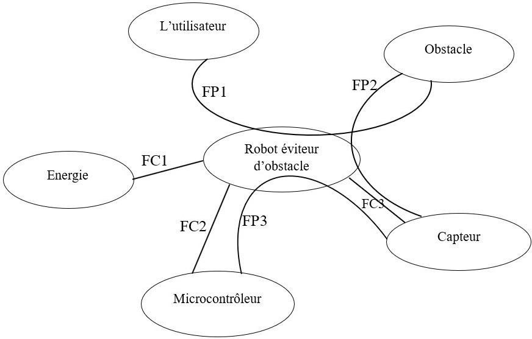
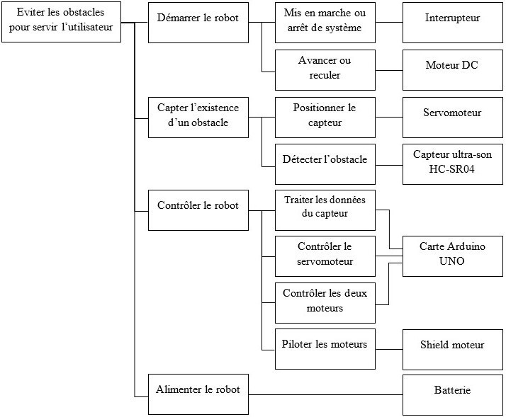
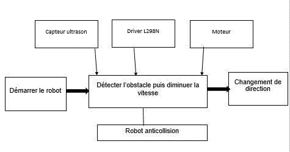
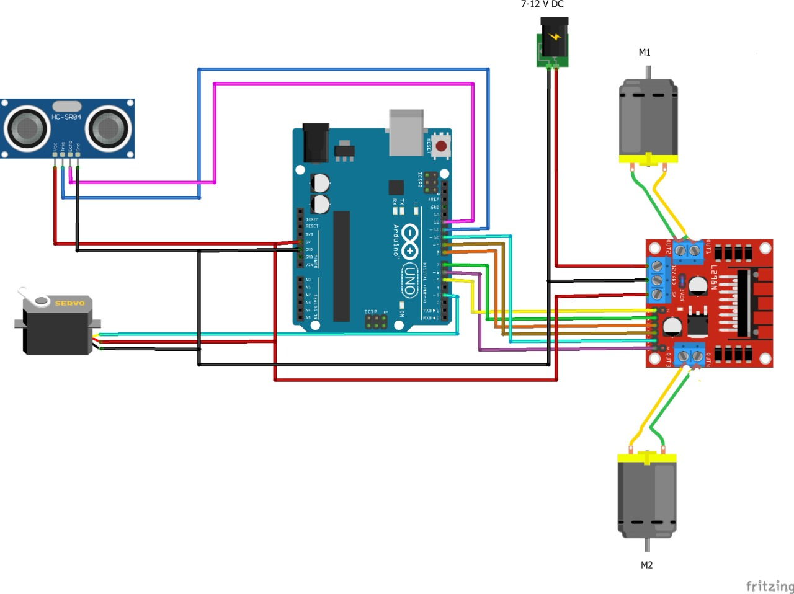

<h1 align="center">Voiture automatisé anti-collision</h1>
 <p align="center" >  </p> 

 <h1 align="center"> Résumé</h1>
<p>
La robotique est définie comme étant l’ensemble des techniques
permettant la conception et la réalisation de machines automatiques ou
de robots, elle est basée sur les capteurs, des systèmes logiques à base
des microprocesseurs et les actionneurs. Le robot éviteur d’obstacle,
machine servant à éviter la collision avec des obstacles inattendus, se
compose aussi des dispositifs cités ci-dessus et qu’à travers lesquels il
assure son mouvement. Dans les différentes parties de notre projet, on a
compris le rôle de chaque composant dans la conception du robot, et par
conséquent, en partant d’un robot particulier, on a pu déduire le
fonctionnement des robots en général et le secret de leurs intelligences.
</p>

 <h1 align="center"> Abstract</h1>
<p>
Robotics is defined as being the set of techniques allowing the design and the realization
of automatic machines or robots, it is based on sensors, logic systems based on microprocessors and actuators. The obstacle avoidance robot, a machine used to avoid collision
with unexpected obstacles, also consists of the devices mentioned above and that through
which it ensures its movement. In the different parts of our project, we understood the
role of each component in the design of the robot, and therefore, starting from a particular
robot, we were able to deduce the functioning of robots in general and the secret of their
intelligences.
</p>

 <h1 align="center"> Introduction</h1>
<p>
Dans le cadre de notre Formation comme des étudiants en ingénierie en Robotique
et Cobotique à l’école d’ingénierie digitale et l’intelligence artificielle (EIDIA) à
l’université ueuromed de Fès, il nous a proposé un projet en Mécatronique.
Dans ce projet nous avons réalisé un robot qui se déplace d'une manière autonome il
doit être capable de détecter son environnement plus précisément les obstacles et
pouvoir les contourner en assurant l’asservissement et la régulation de système

</p>

 <h1 align="center">Description du système </h1>
 <p>
 Notre robot éviteur d’obstacles utilise un capteur qui mesure la distance qui le sépare avec les déférents objets qui l’entoure. L’information est traitée par un microcontrôleur. Le robot avance et lorsqu’il rencontre un obstacle frontal, il s’arrête quelques instants, et il fait tourner le capteur respectivement vers la droite puis vers la gauche puis se tourne vers la direction la plus sûr et il continue en mouvement rectiligne.
</p>

 <h1 align="center"> Matériaux et composants</h1>
 
| Image      | Description |
| :----: | :----: |
| <p >  </p> | Placer les leds , résistanceAider à alimenter le projet.       |
|  <p >  </p>aph   | Carte Arduino avec son cable Arduino USB,Pour téléverser le code        |
|  <p >  </p>   | Capteur ultrason : détecte obstacle         |
| <p >  </p>   | Servomotor: il permet un réglage exact de la position de l’angle,de l’accélération et de la vitesse.        |
| <p >  </p>   | Pilote de moteur L298N : contrôler facilement la direction et la vitesse jusqu’à 2 moteurs à courant continu         |
| <p >  </p>   | Support de 2 pile avec des pille rechargeable,1,9A, 3,6V         |
| <p >  </p>   | Eteindre et allumer le circuitélectrique        |
| <p >  </p>   | Châssis de véhicule robotisé avec 2 moteurs et 3 roues,pour faire marcher notre projet        |
| <p >  </p>   | Transmettre énergie électrique        |


<h1 align="center">Analyse fonctionnelle </h1>


| Graphe des interacteurs      | FAST | SADT     |
| :---        |    :----:   |          ---: |
| <p >  </p>      | <p >  </p>       |  <p >  </p>  |

| Fonction | Description |
| --- | ----------- |
| FP1 | Eviter les obstacles pour servir l’utilisateur |
| FP2 | Capter l’existence d’un obstacle |
| FP3 | Analyser les données fournies par le capteur |
| FC1 | Utiliser une source d’énergie pour alimenter les composants de robot |
| FC2 | Contrôler le déplacement du robot |
| FC3 | Indiquer l’existence d’un obstacle |


 <h1 align="center">Schéma du robot </h1>
 
 <p align="center">  </p>
 
 
 <h1 align="center">Annexe </h1>
```
#include <Servo.h>
#include <NewPing.h>
#define SERVO_PIN 3
#define ULTRASONIC_SENSOR_TRIG 11
#define ULTRASONIC_SENSOR_ECHO 12
#define MAX_REGULAR_MOTOR_SPEED 125
#define MAX_MOTOR_ADJUST_SPEED 175
#define DISTANCE_TO_CHECK 40 //30
//Right motor
int enableRightMotor=5;
int rightMotorPin1=7;
int rightMotorPin2=8;
//Left motor
int enableLeftMotor=6;
int leftMotorPin1=9;
int leftMotorPin2=10;
NewPing mySensor(ULTRASONIC_SENSOR_TRIG, ULTRASONIC_SENSOR_ECHO, 300);
Servo myServo;
void setup()
{
 // put your setup code here, to run once:
 pinMode(enableRightMotor,OUTPUT);
 pinMode(rightMotorPin1,OUTPUT);
 pinMode(rightMotorPin2,OUTPUT);

 pinMode(enableLeftMotor,OUTPUT);
 pinMode(leftMotorPin1,OUTPUT);
 pinMode(leftMotorPin2,OUTPUT);
 myServo.attach(SERVO_PIN);
 myServo.write(90);
 rotateMotor(0,0);
}
void loop()
{
 int distance = mySensor.ping_cm();
 //If distance is within 40 cm then adjust motor direction as below
 if (distance > 0 && distance < DISTANCE_TO_CHECK)
 {
 //Stop motors
 rotateMotor(0, 0);
 delay(500);

 //Reverse motors
 rotateMotor(-MAX_MOTOR_ADJUST_SPEED, -MAX_MOTOR_ADJUST_SPEED);
22
 delay(200);

 //Stop motors
 rotateMotor(0, 0);
 delay(500);

 //Rotate servo to left
 myServo.write(150);
 delay(500);
 //Read left side distance using ultrasonic sensor
 int distanceLeft = mySensor.ping_cm();
 //Rotate servo to right
 myServo.write(20);
 delay(500);
 //Read right side distance using ultrasonic sensor
 int distanceRight = mySensor.ping_cm();
 //Bring servo to center
 myServo.write(90);
 delay(500);

 if (distanceLeft == 0 )
 {
 rotateMotor(MAX_MOTOR_ADJUST_SPEED, -MAX_MOTOR_ADJUST_SPEED);
 delay(200);
 }
 else if (distanceRight == 0 )
 {
 rotateMotor(-MAX_MOTOR_ADJUST_SPEED, MAX_MOTOR_ADJUST_SPEED);
 delay(200);
 }
 else if (distanceLeft >= distanceRight)
 {
 rotateMotor(MAX_MOTOR_ADJUST_SPEED, -MAX_MOTOR_ADJUST_SPEED);
 delay(200);
 }
 else
 {
 rotateMotor(-MAX_MOTOR_ADJUST_SPEED, MAX_MOTOR_ADJUST_SPEED);
 delay(200);
 }
 rotateMotor(0, 0);
 delay(200);
 }
 else
 {
 rotateMotor(MAX_REGULAR_MOTOR_SPEED, MAX_REGULAR_MOTOR_SPEED);
 }
}
void rotateMotor(int rightMotorSpeed, int leftMotorSpeed)
23
{
 if (rightMotorSpeed < 0)
 {
 digitalWrite(rightMotorPin1,LOW);
 digitalWrite(rightMotorPin2,HIGH);
 }
 else if (rightMotorSpeed >= 0)
 {
 digitalWrite(rightMotorPin1,HIGH);
 digitalWrite(rightMotorPin2,LOW);
 }
 if (leftMotorSpeed < 0)
 {
 digitalWrite(leftMotorPin1,LOW);
 digitalWrite(leftMotorPin2,HIGH);
 }
 else if (leftMotorSpeed >= 0)
 {
 digitalWrite(leftMotorPin1,HIGH);
 digitalWrite(leftMotorPin2,LOW);
 }
 analogWrite(enableRightMotor, abs(rightMotorSpeed));
 analogWrite(enableLeftMotor, abs(leftMotorSpeed));
}
```


<h1 align="center">Conclusion </h1>


<h1 align="center">Contact </h1>

<hsaineayoub77@gmail.com>
